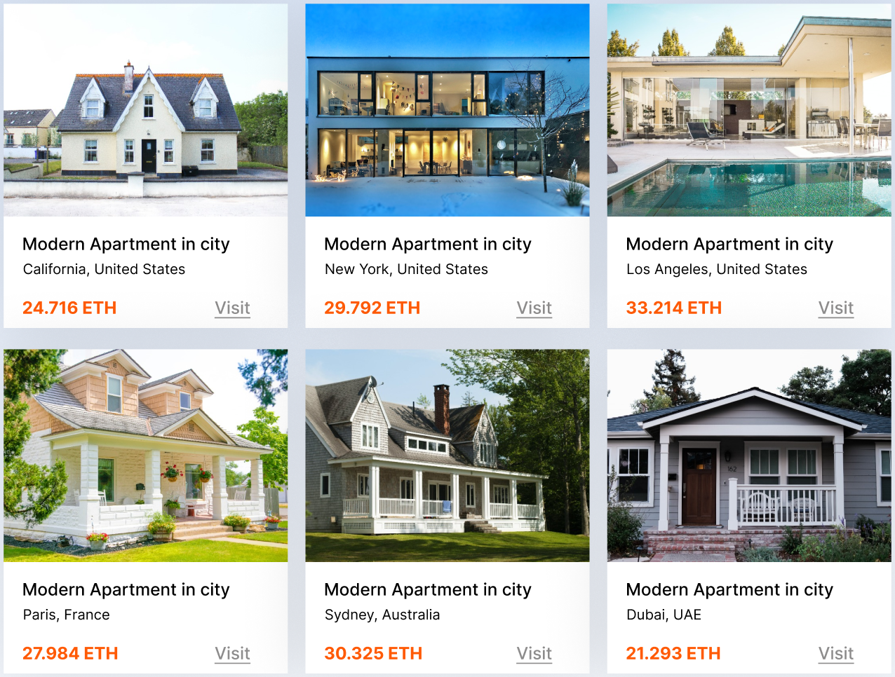

# Real Estate Rental Platform 

Rental Platform aims to revolutionize the rental property market by integrating cryptocurrency payments into a secure, scalable platform that simplifies transactions for property owners and tenants.


### Support a multi-cryptocurrency payment system.

A secure crypto payment system that allows users to pay rent or make deposits using cryptocurrencies.



### 🔥 Web3 is not a temporary trend - it is the future of the Internet!

#### 🚀 Are you ready to enter the Web3 Era? Let's explore a decentralized world today!

### Clone

```
   git clone https://gitlab.com/technical_review-group/real-estate-demo
```

### Install dependencies

```
   npm install
```

### Run on localhost

```
   npm start
```
